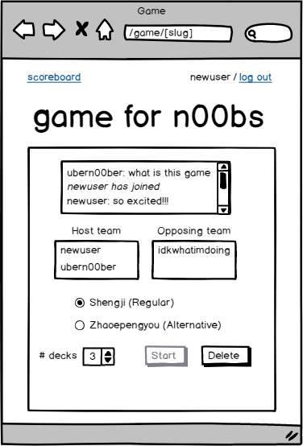
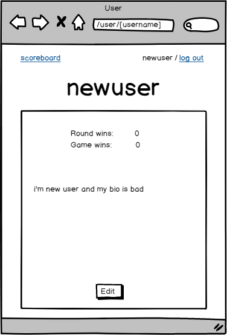

# Shengji

## Overview

Shengji is a Chinese point-based card game I learned from friends and family. Rules and details can be found on [Wikipedia](https://en.wikipedia.org/wiki/Sheng_ji), although house rules and terminology will be updated in here later on regarding the actual implementation, because there is a lot of setup to it.


This project is intended to be a live interaction between multiple clients (players) and the server. Users can log in and view their own/others stats (i.e. rounds won, games won). Games are created/displayed from the home page. Users wait in a game's lobby--users join a game with/without a password. The game can start after 4+ players have joined, and users can choose the mode (regular Shengji or an alternative version, Zhaopengyou) as well as the number of decks. Games can be "paused" between rounds, and users can be in multiple games at once, but once a Game is created, the players cannot change. Additionally, a paused Game would not start unless all players are joined in the group lobby.

## Data Model

The application will store Players, and Games, both related by references.
* Players can have multiple Games
* Games will have multiple Players, the ids of which are in an embedded object

An Example Player:

```javascript
{
  username: 'ultimategamer'
  password: // a password hash
  description: 'hi, i\'m ultimategamer and i like to play this game a lot. also i\'m ultimate at it.'
  roundWins: 100
  gameWins: 50
  games: // an array of references to Game documents
  usersPlayedWith: [{
    user: // reference to Player document
    times: 1,
  }]
  _id: // unique, preset
}
```

An Example Game:

```javascript
{
  name: 'game for n00bs' // required
  mode: // enum: Shengji/Zhaopengyou
  numDecks: 3
  password: // a password hash
  users: [{ // required
    user: // a reference to a Player document
    level: // the level they are on within the game
  }],
  host: // the host of the next round
  slug: 'game-for-n00bs' // generated
}
```

## [Link to Commented First Draft Schema](src/db.js)

## Wireframes

* / - the home page, shows all games that can be joined, and option to create a new game; clicking on a game gives a "pop up" where you input a password if necessary, or else just a button
 


* /game/[game-slug] - the game lobby, users are directed here after submitting the correct password/joining; once the game starts, the page will reload to display the actual game. Between rounds, there will be a button that allows a user to leave the game--then all users are booted from the game and the progress gets saved to the db.




* /user/[username] - a page showing the users stats; if own user, there is an option to edit the description, and to rejoin a paused game




* /scoreboard - showing the top 3 users with highest game wins, and top 3 users with highest round wins


* /login
* /register


## Site map

* all pages
  * scoreboard -> '/scoreboard'
  * login -> '/login', register -> '/register'
  * logout -> '/' and logs out
* /
  * make a new game -> popup with form to create new game
      * create -> POST req to create the game, redirect to '/game/[game-slug]'
  * join game -> popup with password and/or join button
      * join (SUCCESS) -> redirect to '/game/[game-slug]'
      * join (FAIL) -> reload with error message
  * [username] -> '/user/[username]'
* /game/[game-slug]
  * start (disabled until # players >= 4) -> reload page
  * delete game -> redirect to '/', deletes game
  * [username] -> popup with cards that player has played
  * [points collected] -> popup with cards that have been collected
  * end game -> redirects all players to '/', saves game
* /user/[username]
  * edit (for own page) -> reload with bio as text input & option to save
  * rejoin (for own page) -> redirect to '/game/[game-slug]'
* /scoreboard
  * [username] -> '/user/[username]'

## User Stories or Use Cases

1. As non-registered user:
    1. register a new account with the site
    2. view the list of games on the home page
    3. view the scoreboard
    4. view user stats
2. As a registered user:
    1. log in to the site
    2. create a game
    3. join a game
    4. play a game
    5. view the list of games on the home page
    6. view the scoreboard
    7. view user stats
    8. edit own user description

## Research Topics

* (5 points) Integrate user authentication
    * use passport for user authentication
* (3 points) Perform client side form validation custom JavaScript
    * during the game, there are some rules to your play relative to the first play of the turn
      * e.g. if you have cards in the suit they played, you must play cards in that suit
      * e.g. if the first player played a pair of hearts and you have a pair hearts, you must play them
      * these rules will be added to the README later on
* (4 points) Use ReactJS
    * use ReactJS as the frontend framework

12 points total out of 8 required points

## [Link to Initial Main Project File](src/app.js)

## Annotations / References Used

(__TODO__: list any tutorials/references/etc. that you've based your code off of_)
